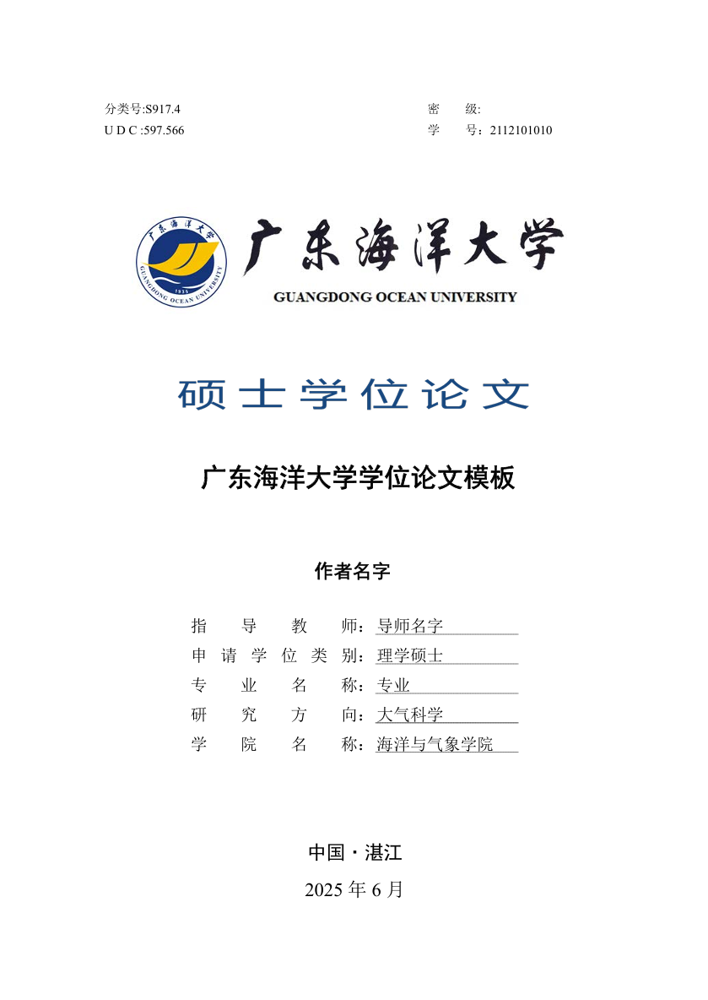

# Guangdong Ocean University LaTeX Thesis Template

This repository provides a LaTeX template for writing academic theses at Guangdong Ocean University (GDOU).  
It is tailored to meet the formatting requirements of GDOU degree theses.

## Features

- Structured template for GDOU theses
- Predefined styles for chapters, bibliographies, and figures
- Sample content included for quick start
- Supports both Windows (`.bat`) and Unix (`.sh`) compilation scripts

## Directory Structure

Below is the main directory structure for the LaTeX template (results may be incomplete, see the [GDOU directory on GitHub](https://github.com/SQYQianYe/GDOU_Latex_Template/tree/main/GDOU) for the full listing):

```
GDOU/
├── Biblio/           # Bibliography files
├── Compile.bat       # Windows compilation script
├── Compile.sh        # Unix compilation script
├── Img/              # Images and figures
├── README.md         # Template documentation
├── Style/            # Style and class files
├── Tex/              # Chapter .tex files and other source files
├── Thesis.pdf        # Example compiled thesis (PDF)
├── Thesis.synctex.gz # SyncTeX file for PDF/TeX synchronization
├── Thesis.tex        # Main LaTeX thesis file
└── example.png       # Example image (see below)
```

> **Note:** The above listing may be incomplete due to API limitations. Visit the [GDOU directory](https://github.com/SQYQianYe/GDOU_Latex_Template/tree/main/GDOU) on GitHub for the most up-to-date contents.


## Getting Started

1. Download or clone this repository.
2. Edit `Thesis.tex` and the files within the `Tex/` directory to match your thesis requirements.
3. Place your figures in the `Img/` directory and bibliography files in `Biblio/`.
4. Compile using the provided scripts:
   - On Windows: `Compile.bat`
   - On Unix/Linux: `Compile.sh`
5. The output PDF (`Thesis.pdf`) will be generated in the `GDOU/` directory.

## Example Image

Below is an example image included in the template directory:



## Source

- Original template: [jiangtian1/GDOU](https://github.com/jiangtian1/GDOU/tree/main)

## License

This repository is licensed under the MIT License.  
See the [LICENSE](./LICENSE) file for details.

---

> For more details or updates, please visit the [project repository](https://github.com/SQYQianYe/GDOU_Latex_Template).
